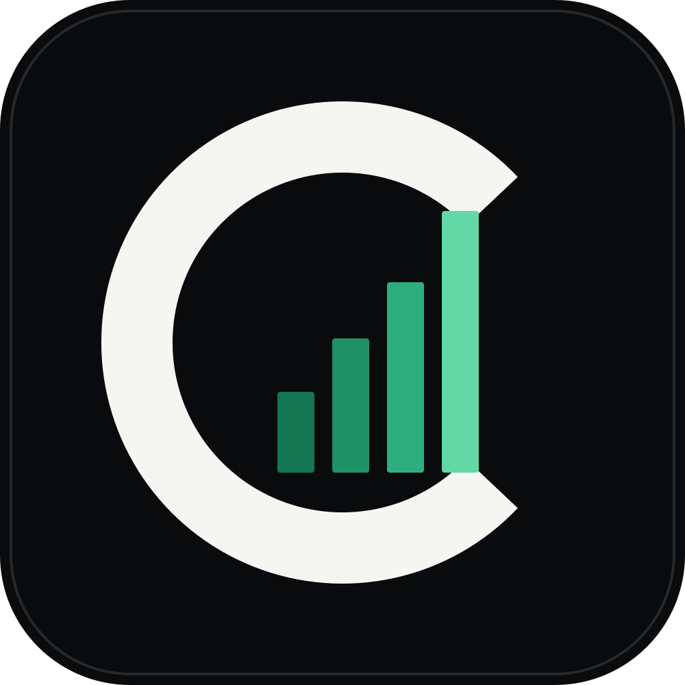

<p align="center">
  
</p>

# Codex Usage Monitor

A lightweight native Windows widget for monitoring Codex usage limits and reset times through the locally installed Codex App Server.

[Website](https://saroo98.github.io/codex-usage-monitor/) · [Releases](https://github.com/saroo98/codex-usage-monitor/releases) · [Privacy](PRIVACY.md) · [Email security](EMAIL_SECURITY.md) · [Support](SUPPORT.md) · [Security](SECURITY.md)

## What it does

- Shows confirmed remaining usage and reset timing in a compact always-available widget.
- Monitors multiple local Codex profiles without browser scraping.
- Preserves the last valid reading when Codex is delayed, offline, or unavailable.
- Supports Windows notifications, quiet hours, local history, and optional self-only email alerts through Gmail, Microsoft 365, Proton Mail Bridge, or encrypted SMTP.
- Stores settings and history locally with bounded, redacted diagnostics.
- Handles portable updates transactionally with integrity checks and startup-health rollback.
- Supports light, dark, High Contrast, keyboard navigation, reduced motion, and 100–200% scaling.

The application contains no project-operated telemetry or advertising.

## Requirements

- Windows 10 build 19041 or later, or Windows 11
- x64 or Arm64 Windows
- The official Codex CLI installed and signed in

Self-contained packages include the required .NET runtime. Framework-dependent packages require the matching .NET 10 Desktop Runtime.

## Install

For a normal Windows installation, open the [GitHub Releases page](https://github.com/saroo98/codex-usage-monitor/releases) and choose the signed `CodexUsageMonitor-6.0.0.msixbundle` marked **Latest stable release**. On x64-only systems, the signed `CodexUsageMonitor-6.0.0-x64.msix` is equivalent. Open the package, accept the Windows install prompt, then complete onboarding. To uninstall, use Windows **Settings > Apps > Installed apps > Codex Usage Monitor > Uninstall**.

The **Portable ZIP** is the secondary option. Choose the x64 self-contained ZIP for most PCs. Extract it to a writable folder such as `C:\Users\<you>\Apps\CodexUsageMonitor`, keep the folder together, and run `CodexUsageMonitor.exe`. The archive contains `portable.mode`, so settings, history, logs, and update state stay in its `data` folder. To uninstall, exit the app from the notification area and delete the extracted folder. No registry entry or separate uninstaller is required.

The framework-dependent ZIP is an advanced option for maintainers or machines that already have the .NET 10 Desktop Runtime. Verify the SHA-256 value of every downloaded artifact against `SHA256SUMS.txt`.

Public v6 packages are the successor to the **v5.0.0 Legacy** release. Use v5.0.0 only when you need to recover an older installation or follow its rollback instructions. Preview, unsigned, or development-signed artifacts are labeled as such and are not the stable download.

Official production artifacts are published only when the release checks described in [CODE_SIGNING_POLICY.md](CODE_SIGNING_POLICY.md) pass. Development-signed or unsigned artifacts are identified explicitly and are not represented as production-signed builds.

## Privacy and security

Codex authentication remains owned by the installed Codex CLI. The monitor does not request a ChatGPT password and is designed not to record prompts, conversations, repository contents, browser cookies, or Codex authentication tokens.

Optional email credentials are protected using Windows security facilities. Email notifications are sent from the configured account back to that same account through a small, tested recipient boundary. Diagnostic exports omit email identities, notification contents, tokens, and credential references. See [EMAIL_SECURITY.md](EMAIL_SECURITY.md), [PRIVACY.md](PRIVACY.md), and [SECURITY.md](SECURITY.md).

## Build from source

The repository pins .NET SDK `10.0.302` in `global.json`.

```powershell
./eng/bootstrap.ps1
./eng/verify.ps1 -Configuration Debug -Architecture x64
```

Complete Release verification for both architectures:

```powershell
./eng/capture-verification-evidence.ps1 -Configuration Release -Architecture All
```

Build and independently verify the unsigned artifact matrix:

```powershell
./eng/package-release.ps1 -Version 6.0.0 -OutputRoot artifacts/release -Configuration Release
```

To include the public OAuth application registrations in a release build:

```powershell
./eng/package-release.ps1 -Version 6.0.0 -OutputRoot artifacts/release -Configuration Release `
  -GoogleOAuthClientId $env:GOOGLE_OAUTH_CLIENT_ID `
  -MicrosoftOAuthClientId $env:MICROSOFT_OAUTH_CLIENT_ID `
  -MicrosoftOAuthTenant common
```

The same values can be passed directly to `dotnet build` or `dotnet publish` as `-p:GoogleOAuthClientId=...`, `-p:MicrosoftOAuthClientId=...`, and `-p:MicrosoftOAuthTenant=common`. These are public native-application registration identifiers. No OAuth client secret is used or embedded.

The repository pins its SDK and NuGet versions, enables deterministic compiler output, builds version tags in GitHub Actions, generates `SHA256SUMS.txt`, and independently reopens and verifies release artifacts. The release tooling also tests byte-identical unsigned portable ZIP output from two builds. Other artifact types are not described as byte-for-byte reproducible.

Generated builds, reports, databases, logs, and local evidence remain under ignored paths and must not be committed.

## Repository layout

- `src/CodexUsageMonitor.Core`: platform-independent domain rules
- `src/CodexUsageMonitor.Application`: use cases, ports, and runtime state
- `src/CodexUsageMonitor.App`: WPF shell, views, view models, and composition
- `src/CodexUsageMonitor.*`: Codex, persistence, notification, email, migration, updater, and Windows adapters
- `tests`: unit, contract, integration, migration, packaging, performance, and UI tests
- `eng`: build, verification, packaging, privacy-audit, and release tooling
- `docs`: static public website

## License

MIT. See [LICENSE](LICENSE) and [THIRD-PARTY-NOTICES.md](THIRD-PARTY-NOTICES.md).

## Disclaimer

This is an independent open-source project. It is not affiliated with, endorsed by, or maintained by OpenAI. Codex, ChatGPT, and OpenAI are trademarks of their respective owners.
